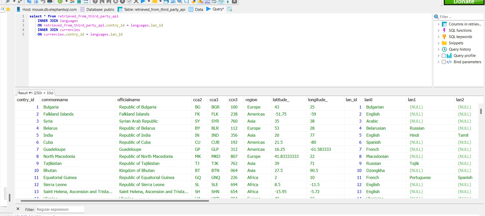
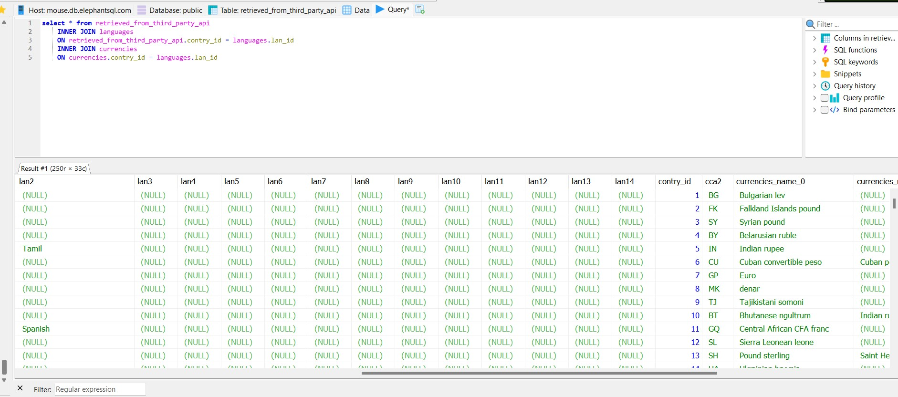
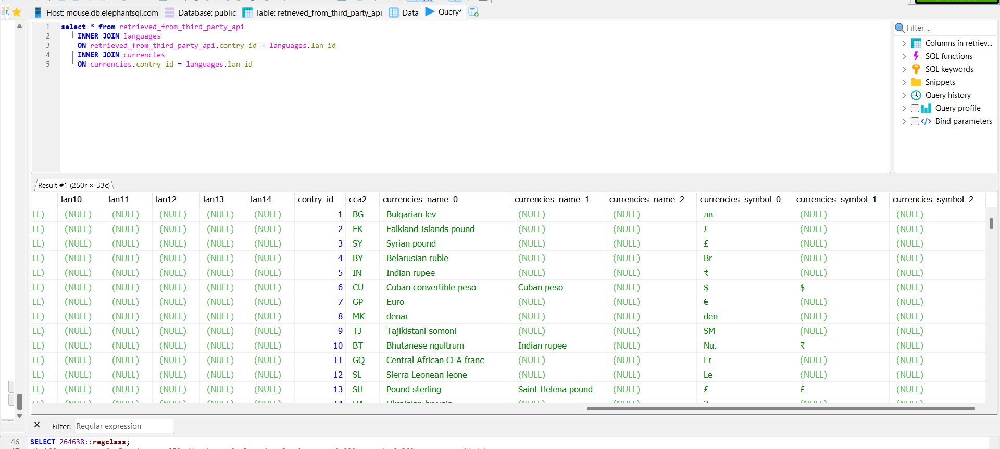

# Task
## How to run the file ==> 
```
npm install
nodemon
```

1.  `/` ==> Get all data 
2.  `/search` ==> search by (common name , official name , cca2 , cca3 , ccn3)
- `/search?name={Replace what in the curly bracket with your input}`
- `/search?cca2={Replace what in the curly bracket with your input}`
- `/search?cca3={Replace what in the curly bracket with your input}`
- `/search?ccn3={Replace what in the curly bracket with your input}`

3.  `/currencies` ==> search by cca2 and get currencies name and currencies symbol 'i add the name i feel its more clear with the name'
- `/currencies?cca2={Replace what in the curly bracket with your input}`
4.  `/group` ==> Group countries => region , language 
- `/group?group={Replace what the curly bracket with your input}`


## DataBase Details 
*connection details*


*tables*


*Database Design*


### *Tables are joined by the id's*
 ex => 
 ```
 select * from retrieved_from_third_party_api 
    INNER JOIN languages
    ON retrieved_from_third_party_api.contry_id = languages.lan_id
    INNER JOIN currencies
    ON currencies.contry_id = languages.lan_id 

 ```

*Result of the query*

 
 
 